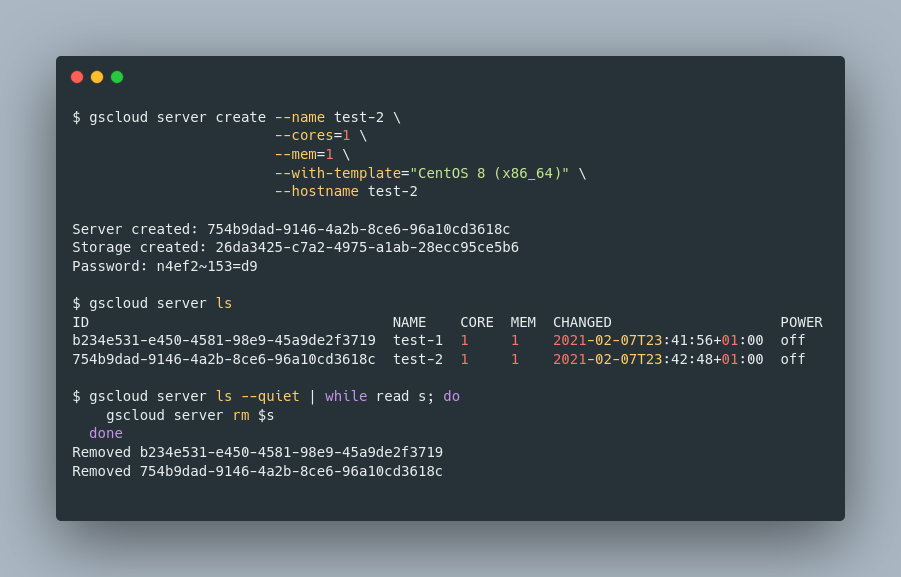

# gscloud

gscloud is a command-line tool that lets you manage your virtual infrastructure on [gridscale.io](https://gridscale.io).

gscloud is written in Go, so everything you need is just the gscloud binary. Compile it all by yourself or get the official release from the [release page](https://github.com/gridscale/gscloud/releases).



## Examples

See [examples](docs/examples.md) to get some first impressions.

## Installation

### Official releases for Windows, macOS, Linux, FreeBSD

Download packaged binaries from the [releases page](https://github.com/gridscale/gscloud/releases).

### OpenBSD

*TODO*

### Build from source

See [here](docs/source.md) on how to build gscloud from source.

## Configuration

You can use `gscloud make-config` to generate a new config file. Make sure to add your user ID and API token here.

Default locations:
- Linux: `~/.kube/config`
- Mac: `~/Library/Application Support/gscloud/config.yaml`
- Windows: `%APPDATA%` or `"C:\\Users\\%USER%\\AppData\\Roaming"`

Example config:

```yml
projects:
- name: default
  userId: 2727b9ab-65ff-4d1e-af5e-d08d682bd1fa
  token: 6eb139b3b6515515a6f358d3a635e9b38f05935782602d4fd5c1b5716af54526
- name: liveaccount
  userId: 2727b9ab-65ff-4d1e-af5e-d08d682bd1fa
  token: 6eb139b3b6515515a6f358d3a635e9b38f05935782602d4fd5c1b5716af54526
  url: https://api.gridscale.io
```

## Kubernetes

You can use gscloud to retrieve the kubeconfig of your managed Kubernetes cluster via 
`gscloud kubernetes cluster save-kubeconfig --credential-plugin --cluster <CLUSTER_UUID>`

That way, gscloud will use the gridscale credentials configured in your gscloud
configuration to obtain a kubeconfig for your cluster and add that as a new context to your
`~/.kube/config`.

If you execute the command with `--credential-plugin`, as given in the example above, gscloud
will register itself as the credential plugin for the context and thereby automatically renew
the kubeconfig for you, once it has expired. If you do not pass in `--credential-plugin`, the
certificate will expire and can be renewed by running gscloud manually again.

When using gscloud in the context of a pipeline, the use of `--credential-plugin` is discouraged,
as it can lead to colliding kubeconfig renewals, unless gscloud's cache directory is persisted
across steps as an artifact.

## Exit codes

gscloud returns zero exit code on success, non-zero on failure. Following exit codes map to these failure modes:

1. The requested command failed.
2. Reading the configuration file failed.
3. The configuration could not be parsed.
4. The project specified does not exist in the configuration file.

## Shell completions

Generate shell completion scripts for zsh and bash.

* bash

```shell
$ gscloud completion bash >> ~/.bash_profile
```

* zsh

```shell
$ gscloud completion zsh >> ~/.zshrc
```

## Install man-pages

Generate man-pages and install them. Example:

```shell
$ sudo gscloud manpage /usr/local/share/man/man1/
```

## Contributing

Please create an [issue](https://github.com/gridscale/gscloud/issues) if you have questions, want to start a discussion, or want to start work on something.

[Pull requests](https://github.com/gridscale/gscloud/pulls) are always welcome. Make sure to create an issue first to signal others that you are working on something. Also make sure to take a look at the [Development Notes](docs/development.md).

Have fun!
